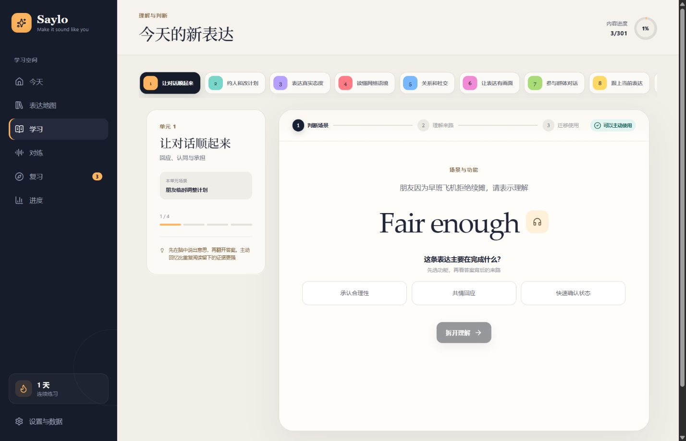
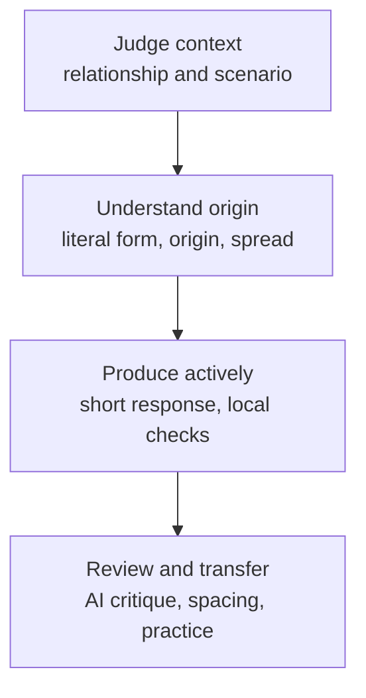
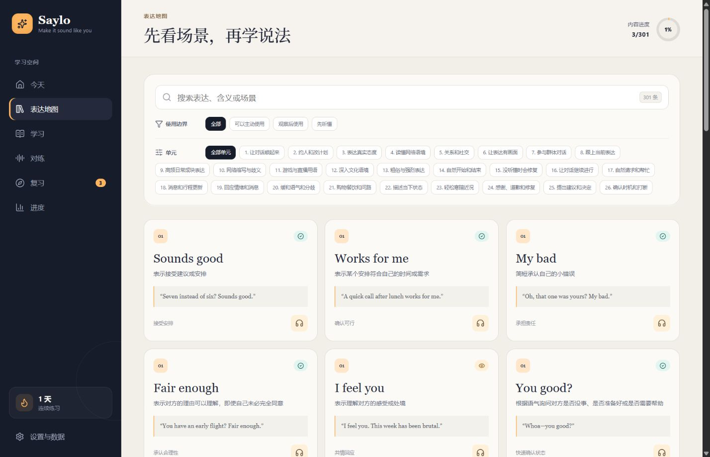
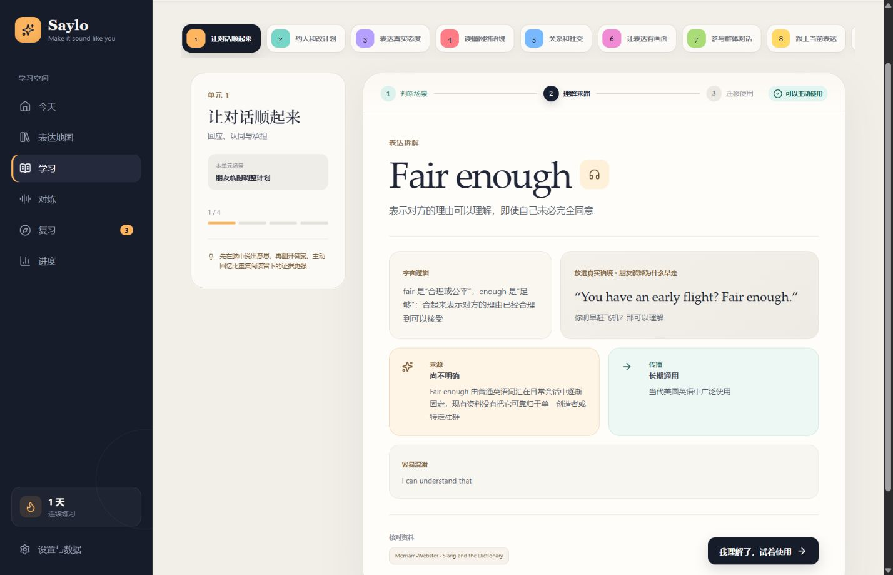
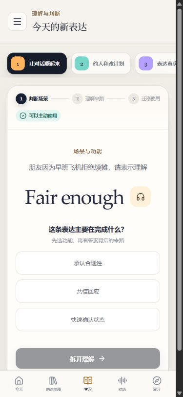
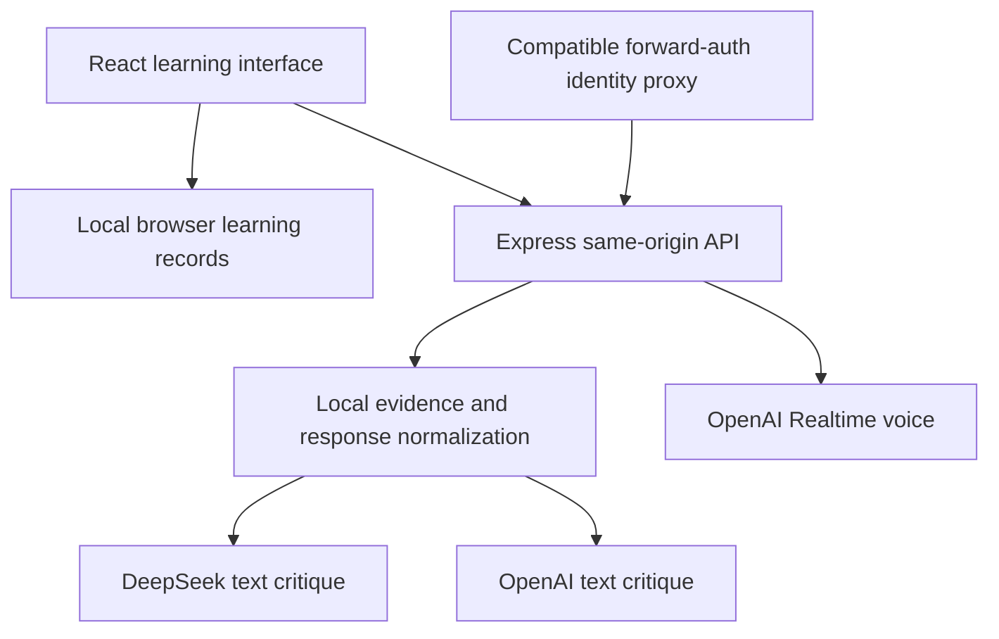

<div align="center">


<h1>Saylo</h1>

<p><strong>Move from understanding contemporary English to using it naturally in real relationships</strong></p>

<p>A local-first, scenario-driven system for practicing contemporary English expressions</p>

<p>
  <a href="#8-project-status"></a>
  <a href="README.md"></a>
  <a href="#7-data-security"></a>
  <a href="#4-quick-start"></a>
</p>

<p>
  <a href="#1-project-value">Project and paths</a> ·
  <a href="#4-quick-start">Quick start</a> ·
  <a href="#2-learning-loop">Learning experience</a> ·
  <a href="#21-one-complete-learning-task">Task evidence</a> ·
  <a href="#6-runtime-architecture">Architecture</a> ·
  <a href="#9-quality-validation">Validation</a> ·
  <a href="#12-contributing">Contributing</a>
</p>

<p><a href="README.md">简体中文</a> · <a href="README.en.md">English</a></p>

</div>

<div align="center">



Figure 1.1. Saylo desktop scenario judgment and progressive learning interface from the repository product capture dated 2026-08-24

</div>

> [!CAUTION]
> This is a local README pilot for human review and does not mean the remote `saylo` repository has been updated

> [!NOTE]
> Saylo is in public beta. Its curriculum structure and automated checks are established, while external review by a real American English teacher and source-community advisers remains pending
>
> Numerical statements in this document come from current repository data, configuration files, product captures, and the local verification record, including product counts, capture dates, viewport sizes, versions, settings, and test results

## 1 Project value

According to `src/data/expressions.ts` and the `npm run audit:content` content audit, Saylo currently contains 301 contemporary English expressions across 26 pragmatic units

Learners judge the situation and relationship before studying literal structure, origin, spread, and usage boundaries

Active output, review, and practice move that understanding toward transferable use

The system prioritizes whether an expression fits the current relationship and task. It does not treat slang density as English proficiency or encourage imitation of any community accent

### 1.1 Choose a path

<table>
  <tr>
    <td width="33%" valign="top">
      <h3>See the learning experience</h3>
      <p>Review the learning loop and real interface to understand how Saylo connects scenario judgment, expression history, and active output</p>
    </td>
    <td width="33%" valign="top">
      <h3>Start locally</h3>
      <p>Use the quick start for the core curriculum, review, search, and backup features without requiring a cloud model key</p>
    </td>
    <td width="33%" valign="top">
      <h3>Prepare model features</h3>
      <p>Review critique responsibilities and data boundaries before configuring optional text critique or realtime voice services</p>
    </td>
  </tr>
</table>

## 2 Learning loop

Saylo separates deterministic evidence from language-model critique

Local rules check literal matches, risk boundaries, and curriculum requirements

Optional AI models analyze grammar, collocation, naturalness, and cultural fit

### 2.1 One complete learning task

The following task evidence connects the landing-page capture, learning flow, and observable results so readers do not have to infer the product behavior from separate screenshots

<div align="center">

Table 2.1. Task evidence from scenario judgment to transferred use

| Stage | Learner action | Interface evidence | Observable result |
|---:|---|---|---|
| 1 Judge the situation | Identify the relationship, task, and purpose of the response | Scenario question and function choices on the learning page | State what the expression needs to accomplish in the current relationship |
| 2 Understand its background | Review literal logic, examples, origin, spread, and confusable expressions | Layered cards on the understanding page | Separate meaning, spread, and usage boundaries |
| 3 Produce an answer | Write a short response and run local evidence checks | Text-practice and curriculum requirements | See target-expression matches, length, repetition, and risk boundaries |
| 4 Review and transfer | Enter review from the recall result, then reuse the expression in text or voice practice | Review scheduling and practice entry points | Receive the next review schedule and a new transfer task |

</div>

<div align="center">



Figure 2.1. Saylo learning loop from understanding to transfer, based on the current repository flow

</div>

### 2.2 Interface evidence

The primary image shows scenario judgment. The following three captures separately establish expression discovery, background understanding, and narrow-screen learning without repeating decorative variants of the same page

<div align="center">



Figure 2.2. Saylo desktop expression map from the repository product capture dated 2026-08-24

</div>

<div align="center">



Figure 2.3. Saylo expression-background stage from the repository product capture dated 2026-08-24

</div>

<div align="center">



Figure 2.4. Saylo mobile interface from a 375 × 811-pixel screenshot showing narrow-screen navigation, scenario judgment, and learning actions

</div>

## 3 Core capabilities

The following status comes from current repository data, page implementations, and automated tests

<div align="center">

Table 3.1. Saylo public-beta capabilities

| Area | Current implementation |
|---|---|
| Content system | 301 expression cards, 26 pragmatic units, 20 role tasks, and 156 high-frequency everyday expressions |
| Learning path | Scenario judgment, literal structure, separate origin and spread, usage boundaries, active output, and neutral alternatives |
| Risk controls | Green, yellow, and red boundaries; high-risk expressions default to recognition practice |
| Review scheduling | Free Spaced Repetition Scheduler uses recall outcomes to schedule the next review |
| Text critique | Local evidence checks with optional five-dimension DeepSeek or OpenAI pragmatic critique |
| Voice practice | Browser speech playback and transcription when available, with optional OpenAI Realtime practice |
| Learning data | The current browser stores progress, activity, favorites, and feedback with JSON backup, restore, and clearing |
| Clients | Responsive desktop and mobile layouts that can be installed as a progressive web app |

</div>

## 4 Quick start

### 4.1 Requirements

- Node.js 20 or later, based on the current server syntax and deployment environment
- A modern browser with JavaScript, Web Speech, and WebRTC support; exact voice behavior depends on the browser implementation

The following major versions come from the current `package.json` and preserve the environment details previously shown in README badges

<div align="center">

Table 4.1 Saylo runtime and development stack

| Technology | Current major version | Current responsibility |
|---|---:|---|
| React | 19 | Builds the learning interface and interactive state |
| TypeScript | 5.9 | Checks web code, project references, and build inputs |
| Vite | 8 | Starts the local web interface and creates the production build |
| Express | 5 | Provides same-origin coaching, key, and realtime voice endpoints |
| Node.js | 20 or later | Runs the local service, tests, and build scripts |

</div>

### 4.2 Run locally

- First, clone the repository and enter its directory

```bash
git clone https://github.com/<owner>/saylo.git # Replace owner with the repository owner and download the source
cd saylo # Enter the project directory
```

- Second, install the locked dependency versions

```bash
npm install # Install development and runtime dependencies from package-lock.json
```

- Third, start the web client and local coach server

```bash
npm run dev # Start the Vite client and Express API on the current device by default
```

- Fourth, open the local web address printed in the terminal

Without a cloud key, the curriculum, review, expression search, local feedback, browser playback, statistics, and backup features remain available

### 4.3 Enable cloud critique

- First, copy `.env.example` to `.env`

- Second, set `DEEPSEEK_API_KEY` or `OPENAI_API_KEY` in `.env`

- Third, restart the local development service

Authenticated production users can also validate and save their own DeepSeek key in Settings

The server isolates configuration by authenticated identity, and the browser cannot read a stored key back

## 5 Critique responsibilities

According to the response contract in `server/index.mjs`, Saylo evaluates a short response across five dimensions: task completion, relationship and tact, naturalness, conversational progress, and target-expression use

<div align="center">

Table 5.1. Responsibility boundaries for Saylo critique evidence

| Evidence source | Appropriate judgments | Explicit limits |
|---|---|---|
| Local rules | Literal target-expression matches, curriculum gates, length, repetition, and risk boundaries | Cannot reliably judge complete grammar, collocation, or cultural nuance |
| DeepSeek or OpenAI | Grammar, collocation, tone, relationship fit, and natural rewrites | Output can depart from contracted enums; the server normalizes it and uses local evidence to correct factual conflicts |
| Browser speech capabilities | Transcription and playback signals | Not used to infer ethnicity or make final judgments about accent quality |

</div>

When local rules obtain a complete phrase-match signal, Saylo uses that evidence to correct a model's target-expression judgment

The model remains responsible for whole-sentence naturalness, relationship fit, and conversational progress

## 6 Runtime architecture

The following data flow shows how the browser connects local evidence, an identity proxy, and optional model providers

<div align="center">



Figure 6.1. Generic data flow among the Saylo application, identity proxy, and optional model providers

</div>

The browser only calls the same-origin `/api` endpoints

The server reads keys, limits request rates, validates model output, and filters expression identifiers that the curriculum cannot support

Server configuration priority is the current authenticated user's saved DeepSeek configuration, server DeepSeek environment, server OpenAI environment, and local evidence critique

## 7 Data security

> [!IMPORTANT]
> Cloud text critique and realtime voice activate only after a maintainer or user configures a model service. The local core learning path does not depend on cloud keys

- API keys stay in the server environment or a per-user configuration file with `0600` permissions; they do not enter browser storage, learning backups, or GitHub
- Cloud text critique sends the current answer, practice scenario, learned expressions, and current dialogue turn rather than the complete learning record
- Learning progress and text activity stay in the current browser's `localStorage` by default
- Raw microphone audio is not written to Saylo learning records; realtime voice sends audio to the configured OpenAI service during the session
- A compatible forward-auth reverse proxy can protect production deployment, and the application service should listen only on a server loopback address
- The public repository contains source, beta curriculum content, and blank configuration templates without account passwords, access tokens, user learning records, or server environment files

## 8 Project status

The following status comes from current content-governance records, automated checks, and a license-file check

<div align="center">

Table 8.1. Saylo public delivery boundary

| Object | Current status | Supported reader decision |
|---|---|---|
| Application source | Public beta | Readers can inspect and validate the current implementation locally |
| Content structure | Automated checks complete | Expression structure, duplicates, risk fields, answers, and everyday-function coverage are under test |
| External language review | Pending | Repository content does not represent certification by a real teacher or source community |
| Repository license | Not provided | Public visibility does not automatically grant rights to copy, modify, redistribute, or use commercially |

</div>

Deployers can choose the site's access scope through their own identity system and access policy

## 9 Quality validation

```bash
npm run check # Check TypeScript types and project references
npm run audit:content # Check expression counts, duplicates, source fields, answers, and everyday-function coverage
npm test # Run curriculum, critique, review-scheduling, and server-security tests
npm run build # Produce the production build and validate static assets
npm run verify # Run the complete test and production-build sequence
```

According to the local `npm run verify` record dated 2026-08-24, 21 tests in four Vitest files, two Node.js server tests, the content audit, and the production build passed

Real-browser acceptance covers first-run setup, baseline judgment, learning, review, text practice, expression search, risk details, progress, and backup

### 9.1 README visual and evidence coverage

This matrix records only what the current repository captures and local README preview can establish. Missing product states remain explicit evidence gaps

<div align="center">

Table 9.1. Saylo README visual validation scope

| Scenario | Current evidence | Local-preview requirement | Evidence boundary |
|---|---|---|---|
| Desktop primary task | Three 1428 × 919-pixel product captures | Landing, discovery, and understanding content remain clear without page-level horizontal overflow | Captures cover the light product interface |
| Narrow primary task | One 375 × 811-pixel product capture | The image scales completely while navigation and primary actions stay legible | Current material covers one mobile learning path |
| Light README | Local GitHub-style rendering | Headings, badges, tables, images, and Mermaid remain clear | Does not establish identical product behavior in every browser |
| Dark README | Local GitHub-style rendering | Transparent SVGs, text, and boundaries remain legible | The repository currently provides no product dark-theme capture |
| Image failure | Alternative text, captions, and the task-evidence table | The learning task and first-success path remain understandable with images hidden | Cannot replace pixel-level interface detail |
| External image-service failure | Badges and product captures are repository-local | Core content makes no third-party image request | Documentation links in the prose still require network access |

</div>

## 10 Repository structure

```text
# These directories define the primary responsibilities in the current repository
src/data/       # Curriculum units, role tasks, and expression cards
src/lib/        # Review scheduling, coaching, speech, analytics, and content policy
src/pages/      # Pages learners operate directly
server/         # Text critique, personal keys, and realtime voice endpoints
deploy/         # Generic reverse-proxy and system-service examples
docs/           # Teaching plan, content governance, deployment guide, audits, and product images
```

## 11 Production deployment

The recommended chain is transport-security termination → reverse proxy → optional identity proxy → Saylo loopback service

The repository provides generic Nginx web-server and systemd service examples whose domains, accounts, directories, and identity headers use placeholders

The [generic deployment guide](docs/DEPLOYMENT.md) covers environment variables, the identity-proxy contract, key isolation, and post-release health checks

## 12 Contributing

The project currently prioritizes the following verifiable evidence:

- Reproductions of misjudgments in real conversational contexts
- Primary or authoritative sources for expression origins, spread, and usage boundaries
- Inconsistencies among Chinese and English meanings, examples, review prompts, and role tasks
- Mobile, keyboard, screen-reader, and voice-capability problems

When submitting a problem, include the expression, scenario, actual result, expected result, and reproduction steps

Remove names, account identifiers, keys, and other identity information before sharing real conversations

## 13 References

[1] OpenAI, “Text generation,” *OpenAI API Documentation*. [Online]. Available: https://developers.openai.com/api/docs/guides/text

[2] OpenAI, “Realtime API with WebRTC,” *OpenAI API Documentation*. [Online]. Available: https://developers.openai.com/api/docs/guides/realtime-webrtc

[3] DeepSeek, “JSON Output,” *DeepSeek API Docs*. [Online]. Available: https://api-docs.deepseek.com/guides/json_mode
