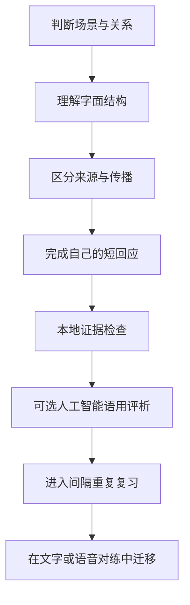
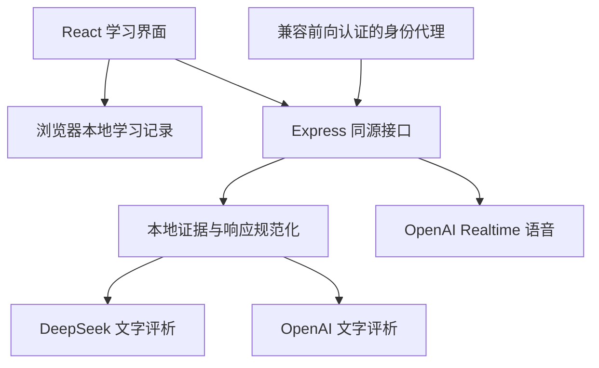

<div align="center">


<h1>Saylo</h1>

<p><strong>从看懂当代英语，到在真实关系里自然说出来</strong></p>

<p>本地优先、场景驱动的当代英语表达训练系统</p>

<p>
  <a href="#8-项目状态"></a>
  <a href="README.en.md"></a>
  <a href="#7-数据安全"></a>
  <a href="#4-快速开始"></a>
</p>

<p>
  <a href="#1-项目价值">项目与路径</a> ·
  <a href="#4-快速开始">快速开始</a> ·
  <a href="#2-学习闭环">学习体验</a> ·
  <a href="#6-运行架构">运行架构</a> ·
  <a href="#9-质量验证">质量验证</a> ·
  <a href="#12-贡献流程">参与贡献</a>
</p>

<p><a href="README.md">简体中文</a> · <a href="README.en.md">English</a></p>

</div>

<div align="center">


图 1 Saylo 桌面端场景判断与渐进学习界面，来源为 2026-08-24 仓库产品截图

</div>

> [!NOTE]
> Saylo 当前处于公开测试阶段，课程结构和自动检查已经建立，真实美国英语教师与来源社群顾问的外部审校仍在等待完成
>
> 本文中的数值均来自当前仓库数据、配置文件、产品截图和本轮验证记录，范围包括产品数量、截图日期、视口、版本、配置和测试结果

## 1 项目价值

根据 `src/data/expressions.ts` 和 `npm run audit:content` 的内容审计，Saylo 当前收录 301 条当代英语表达，分布在 26 个语用单元

学习者先判断场景与关系，再理解字面结构、来源、传播范围和使用边界

主动输出、复习和对练负责把理解推进到可迁移使用

系统优先判断表达是否适合当前关系和任务，不把俚语密度当作英语水平，也不鼓励模仿任何族群口音

### 1.1 选择上手路径

<table>
  <tr>
    <td width="33%" valign="top">
      <h3>先看学习体验</h3>
      <p>查看学习闭环和真实界面，理解 Saylo 怎样把场景判断、表达来路和主动输出连接起来</p>
    </td>
    <td width="33%" valign="top">
      <h3>本地开始学习</h3>
      <p>按照快速开始运行核心课程、复习、检索和备份功能，本地使用不需要云端模型密钥</p>
    </td>
    <td width="33%" valign="top">
      <h3>准备启用模型</h3>
      <p>先阅读评析职责和数据安全边界，再配置可选的文字评析或实时语音服务</p>
    </td>
  </tr>
</table>

## 2 学习闭环

Saylo 把确定性证据和语言模型评析分开处理

字面命中、风险边界和课程要求由本地规则核对

语法、搭配、自然度和文化分寸交给可选的 AI 人工智能（Artificial Intelligence）模型分析

<div align="center">



图 2.1 Saylo 从理解到迁移的学习闭环，根据当前仓库学习流程绘制

</div>

<div align="center">


图 2.2 Saylo 表达地图桌面端实际界面，来源为 2026-08-24 仓库产品截图

</div>

<div align="center">


图 2.3 Saylo 理解来路阶段实际界面，来源为 2026-08-24 仓库产品截图

</div>

<div align="center">


图 2.4 Saylo 移动端实际界面，来源为宽度 390 像素的浏览器验收截图

</div>

## 3 核心能力

以下状态来自当前仓库数据、页面实现和自动化测试

<div align="center">

表 3.1 Saylo 公开测试版能力

| 范围 | 当前实现 |
|---|---|
| 内容系统 | 301 条表达卡、26 个语用单元、20 个角色任务、156 条高频日常口语 |
| 学习路径 | 场景判断、字面结构、来源与传播分读、使用边界、主动输出和中性替代 |
| 风险控制 | 绿色、黄色、红色三档边界；高风险表达默认进入识别层 |
| 复习调度 | FSRS 自由间隔重复调度器（Free Spaced Repetition Scheduler）根据回忆结果安排下一次复习 |
| 文字评析 | 本地证据检查；可选 DeepSeek 或 OpenAI 五维语用评析 |
| 语音练习 | 浏览器朗读与可用时的语音转写；可选 OpenAI Realtime 实时语音对练 |
| 学习数据 | 当前浏览器保存进度、活动、收藏和反馈；支持 JSON 轻量数据交换格式（JavaScript Object Notation）备份、恢复与清空 |
| 使用终端 | 桌面与移动端响应式布局，可以作为渐进式网页应用添加到主屏幕 |

</div>

## 4 快速开始

### 4.1 环境要求

- Node.js 20 或更高版本，版本要求来自当前服务端运行语法和部署环境
- 支持现代 JavaScript、Web Speech 浏览器语音接口和 WebRTC 网页实时通信的浏览器，具体语音能力取决于浏览器实现

以下主版本来自当前 `package.json`，用于核对旧版 README 徽章和本地开发环境

<div align="center">

表 4.1 Saylo 主要运行与开发技术

| 技术 | 当前主版本 | 当前职责 |
|---|---:|---|
| React | 19 | 构建学习界面和交互状态 |
| TypeScript | 5.9 | 检查网页代码、项目引用和构建输入 |
| Vite | 8 | 启动本地网页并生成生产构建 |
| Express | 5 | 提供同源评析、密钥和实时语音接口 |
| Node.js | 20 或更高版本 | 运行本地服务、测试和构建脚本 |

</div>

### 4.2 本地运行

- 第一步，克隆仓库并进入项目目录

```bash
git clone https://github.com/<owner>/saylo.git # 把 owner 替换为仓库所有者后下载源码
cd saylo # 进入项目目录
```

- 第二步，安装锁定版本的依赖

```bash
npm install # 根据 package-lock.json 安装开发与运行依赖
```

- 第三步，启动网页和本地教练服务器

```bash
npm run dev # 启动 Vite 网页和 Express 接口，默认仅监听当前设备
```

- 第四步，打开终端显示的本地网页地址

没有云端密钥时，课程、复习、表达检索、本地反馈、浏览器朗读、数据统计和备份功能保持可用

### 4.3 启用云端评析

- 第一步，把 `.env.example` 复制为 `.env`

- 第二步，在 `.env` 中填写 `DEEPSEEK_API_KEY` 或 `OPENAI_API_KEY`

- 第三步，重新启动本地开发服务

生产环境的已登录用户也可以在设置页验证并保存自己的 DeepSeek 密钥

服务器按登录身份隔离配置，浏览器无法读回已经保存的密钥

## 5 评析职责

根据 `server/index.mjs` 的响应规范，Saylo 使用 5 个维度评析短回应：任务完成、关系与分寸、自然度、互动推进和目标表达使用

<div align="center">

表 5.1 Saylo 评析证据的职责边界

| 证据来源 | 擅长判断 | 明确限制 |
|---|---|---|
| 本地规则 | 目标表达字面命中、课程硬门槛、长度、重复和风险边界 | 无法可靠判断完整语法、搭配和文化分寸 |
| DeepSeek 或 OpenAI | 语法、搭配、语气、关系适配和自然改写 | 输出可能偏离约定枚举，服务端会归一化并用本地证据纠正事实冲突 |
| 浏览器语音能力 | 提供转写与朗读线索 | 不用于推断族裔，也不作为口音优劣的最终判断 |

</div>

本地规则取得完整词组命中证据后，Saylo 会用这条证据纠正模型的目标表达误判

模型继续负责分析整句自然度、关系适配和对话推进

## 6 运行架构

以下数据流说明浏览器怎样连接本地证据、身份代理和可选模型供应商

<div align="center">



图 6.1 Saylo 应用、身份代理和可选模型供应商之间的通用数据流

</div>

浏览器只调用同源 `/api` 应用程序接口（Application Programming Interface）

服务器负责读取密钥、限制请求频率、验证模型输出并过滤无法由课程材料支持的表达标识

服务器配置优先级为：当前登录用户保存的 DeepSeek 配置、服务器环境中的 DeepSeek、服务器环境中的 OpenAI、本地证据评析

## 7 数据安全

> [!IMPORTANT]
> 云端文字评析和实时语音只在维护者或使用者主动配置模型服务后启用，本地核心学习路径不依赖云端密钥

- API 密钥只保存在服务器环境或权限为 `0600` 的个人配置文件中，不进入浏览器本地存储、学习备份或 GitHub
- 云端文字评析只发送当前回答、练习场景、已学表达和本轮对话，不发送完整学习记录
- 学习进度和文字活动默认保存在当前浏览器的 `localStorage` 本地存储中
- 原始麦克风音频不会写入 Saylo 学习记录；启用实时语音后，音频会在会话期间发送给配置的 OpenAI 服务
- 生产部署可以通过兼容前向认证的反向代理保护，应用服务建议只监听服务器回环地址
- 公共仓库包含源码、测试版课程内容和空白配置模板，不包含账户密码、访问令牌、用户学习记录或服务器环境文件

## 8 项目状态

以下状态来自当前仓库内容治理记录、自动化检查和许可证文件检查

<div align="center">

表 8.1 Saylo 公开交付边界

| 对象 | 当前状态 | 读者可以据此判断什么 |
|---|---|---|
| 应用源码 | 公开测试版 | 可以检查和本地验证当前实现 |
| 内容结构 | 自动检查完成 | 表达结构、重复、风险字段、答案和日常功能覆盖已经进入测试 |
| 外部语言审校 | 等待完成 | 仓库内容不代表真实教师或来源社群认证 |
| 仓库许可证 | 未提供 | 公开可见不自动授予复制、修改、再分发或商业使用权 |

</div>

部署者可以根据自己的身份系统和访问策略决定站点开放范围

## 9 质量验证

```bash
npm run check # 检查 TypeScript 类型与项目引用
npm run audit:content # 检查表达数量、重复、来源字段、答案和日常功能覆盖
npm test # 运行课程、评析、复习调度和服务安全测试
npm run build # 生成生产构建并验证静态资源
npm run verify # 连续执行完整测试与生产构建
```

根据 2026-08-24 本地 `npm run verify` 记录，4 个 Vitest 测试文件中的 21 项测试、2 项 Node.js 服务测试、内容审计和生产构建均通过

真实浏览器验收覆盖首次设置、基线判断、学习、复习、文字对练、表达检索、风险详情、进度和备份

## 10 仓库结构

```text
# 以下目录对应当前仓库的主要职责边界
src/data/       # 课程单元、角色任务和表达卡
src/lib/        # 复习调度、教练、语音、统计和内容策略
src/pages/      # 学习者直接操作的页面
server/         # 文字评析、个人密钥和实时语音接口
deploy/         # 通用反向代理和系统服务配置示例
docs/           # 教学方案、内容治理、部署手册、审计记录和产品图
```

## 11 生产部署

推荐链路为传输层安全终止 → 反向代理 → 可选身份代理 → Saylo 回环服务

仓库提供 Nginx 网页服务器和 systemd 系统服务的通用配置示例，域名、账户、目录和身份头均使用占位值

[通用部署手册](docs/DEPLOYMENT.md)介绍环境变量、身份代理契约、密钥隔离和发布后健康检查

## 12 贡献流程

当前优先接受以下类型的可核验证据：

- 真实对话语境中的误判复现
- 表达来源、传播路径和使用边界的一手或权威资料
- 中英文释义、例句、复习题和角色任务之间的不一致
- 移动端、键盘操作、屏幕阅读器和语音能力问题

提交问题时请附上表达、场景、实际结果、预期结果和复现步骤

涉及真实聊天内容时，请先删除姓名、账号、密钥和其他身份信息

## 13 参考文献

[1] OpenAI, “Text generation,” *OpenAI API Documentation*. [在线]. 地址：https://developers.openai.com/api/docs/guides/text

[2] OpenAI, “Realtime API with WebRTC,” *OpenAI API Documentation*. [在线]. 地址：https://developers.openai.com/api/docs/guides/realtime-webrtc

[3] DeepSeek, “JSON Output,” *DeepSeek API Docs*. [在线]. 地址：https://api-docs.deepseek.com/guides/json_mode
