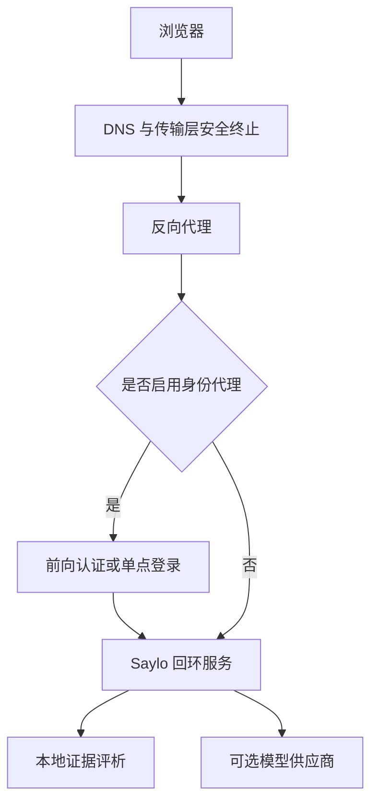

# Saylo 通用生产部署

本文使用 `saylo.example.com`、`/opt/saylo` 和 `saylo` 作为占位值

部署者需要根据自己的域名、服务器目录和运行账户替换这些值

## 1 推荐架构

以下流程把公开网络入口、身份验证和应用进程分开，任何兼容同一身份头契约的代理都可以接入

<div align="center">



图 1.1 Saylo 通用生产请求链路

</div>

反向代理负责公开域名、证书、安全响应头和请求大小限制

Saylo 只监听 `127.0.0.1`，避免应用端口绕过代理直接暴露

## 2 部署执行

- 第一步，安装锁定依赖并生成生产资源

```bash
npm ci          # 根据锁文件安装完全一致的依赖
npm run verify  # 运行测试、内容审计和生产构建
```

- 第二步，创建独立运行账户和应用目录

仓库中的 `deploy/saylo.service.example` 展示 systemd 系统服务配置

- 第三步，配置反向代理

仓库中的 `deploy/nginx.conf.example` 使用示例域名，并把请求转发到回环服务

- 第四步，检查服务健康状态

```bash
curl --fail http://127.0.0.1:8787/__origin_health  # 只从服务器本机确认应用进程可用
```

## 3 环境变量

<div align="center">

表 3.1 Saylo 生产环境变量

| 变量 | 用途 |
|---|---|
| `HOST` | 应用监听地址，生产环境建议使用 `127.0.0.1` |
| `PORT` | 应用监听端口，默认值为 `8787` |
| `PUBLIC_ORIGIN` | 浏览器实际访问的完整来源，例如 `https://saylo.example.com` |
| `REQUIRE_PROXY_AUTH` | 设为 `true` 后，接口要求身份代理提供受控身份头 |
| `SAYLO_PROVIDER_CONFIG_DIR` | 每位用户的 DeepSeek 配置存放目录 |
| `DEEPSEEK_API_KEY` | 可选的服务器级 DeepSeek 密钥 |
| `OPENAI_API_KEY` | 可选的服务器级 OpenAI 文字与实时语音密钥 |

</div>

密钥文件需要限制为运行账户可读，仓库和网页构建产物都不应包含真实密钥

## 4 身份代理契约

启用 `REQUIRE_PROXY_AUTH=true` 后，可信反向代理需要删除客户端传入的同名字段，再写入以下身份头：

- `X-Authenticated: 1` 表示代理已经完成身份验证
- `X-Auth-User` 提供稳定且不含密钥的用户标识，用于隔离个人模型配置和限制请求频率
- `X-Auth-Role` 可以提供可选角色，当前核心评析接口不依赖具体角色名称

公网客户端可以伪造请求头，因此 Saylo 应用端口需要保持在可信代理之后

## 5 发布检查

- `npm run verify` 完整通过
- 应用进程只监听回环地址
- 未登录请求在启用身份代理后无法访问 `/api` 接口
- 反向代理删除外部传入的身份头并写入可信值
- API 密钥没有进入 Git、网页资源、日志或学习备份
- 桌面端与移动端均可完成学习、复习和文字对练主流程

## 6 私有基础设施

真实域名、服务器地址、远程登录别名、门户索引、云服务账户和内部目录应保存在私有基础设施仓库或部署平台中

公开仓库只保留能够独立理解和安全复用的通用配置
