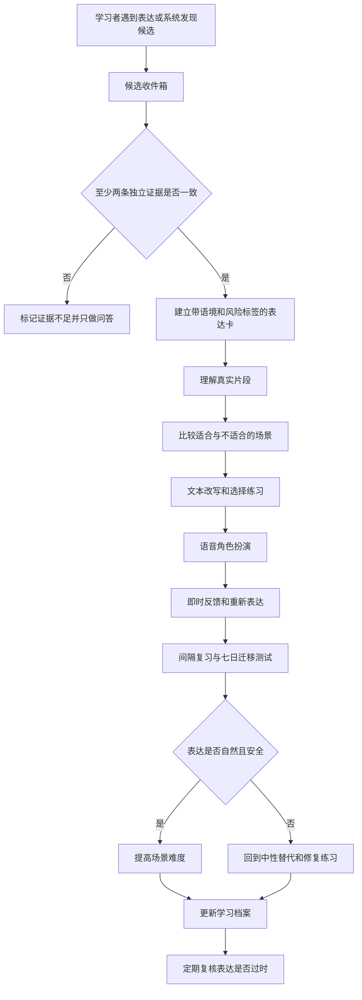

# Saylo 当代英语语用流利度学习系统方案

方案状态：等待用户审核

证据截止日期：2026-08-23，来源为本轮公开资料检索结束时间

目标范围：当代美国英语中的日常口语、网络表达、社群来源表达和语音互动

本文全部数值来自所引直接资料、正文计算过程或明确标出的项目规划估计

## 1 审核结论

本轮决定为 `reframe`，即先改写问题，再按新问题进入低成本试点

用户希望英语表达更生动、更自然，这个目标值得推进

单独背词义很难教会说话者关系、场合、语气和身份边界，这些信息恰好决定俚语能否自然使用

研究同时表明，刻意记忆词汇和搭配仍能帮助保持记忆[1]

系统因此把学习单位从孤立单词升级为带语境的表达卡，同时保留间隔复习

`slang` 是高度依赖社交关系和场合的非正式表达

它变化快，也可能携带地域、年龄、平台和社群身份信号

学习者只知道中文释义时，容易在正式场合、陌生关系或身份敏感语境中误用

项目原始分类“白人、亚裔、黑人 slang”需要改为“语域、地域、代际、平台、关系和来源社群”

非裔美国人语言（African American Language，AAL）具有系统规则和内部差异，不能缩减成一包黑人俚语

黑人、亚裔美国人和白人都覆盖大量地区、世代、阶层和社群，肤色无法稳定预测个人说法[2][3]

项目应先组合成熟工具完成教学试点，再决定是否开发独立应用

OpenLingo 已经提供对话、练习、记忆和语音的开源骨架，ELSA 已经验证了角色扮演后按语域和礼貌等维度反馈的产品形态[4][5]

本项目真正需要验证的新增价值是表达来源、当前扩散范围、使用权限、时效和误用风险这一层

## 2 真实目标

系统训练的核心能力是语用流利度

它表示学习者能够理解表达背后的社交意图，并根据场合、关系和语气选择合适说法

词汇量只能支持其中一部分，完整结果包含以下五项能力：

- 理解：在未见过的新语境中判断表达的意思、态度和潜台词
- 适配：判断表达适合朋友、同事、陌生人、约会、游戏或公开平台中的哪些关系
- 产出：在合适机会自然调用表达，同时避免为了展示俚语而堆叠
- 修复：发现对方困惑或语气失配后，能够改用中性表达、澄清或道歉
- 迁移：从课程例句转移到新话题、真实媒体和真实对话

美国外语教学委员会（American Council on the Teaching of Foreign Languages，ACTFL）发布的 Proficiency Guidelines 2024 按真实、即兴场景中的任务、准确度、语境和文本复杂度描述语言能力[6][7]

本项目因此分别测量理解、互动和表达，不用背过多少词作为总成绩

## 3 内容分类

### 3.1 多维分类

表 3.1 表达卡的主分类维度

| 维度 | 记录内容 | 教学用途 |
|---|---|---|
| 交际功能 | 赞同、拒绝、调侃、缓和、夸张、惊讶、亲近或疏远 | 让学习者先选择意图，再选择表达 |
| 场景 | 朋友聊天、工作交流、约会、游戏、评论区或公开发言 | 防止把私密表达搬进公开或正式场合 |
| 关系 | 熟悉度、权力差、群内或群外关系 | 判断相同说法在不同对象面前是否安全 |
| 语域 | 中性、随意、粗俗、冒犯或回收性使用 | 决定练习强度和反馈方式 |
| 地域与代际 | 地区、年龄群、平台和活跃时期 | 防止把局部或过时表达当成美国人通用说法 |
| 来源社群 | 有直接证据时记录历史来源和相关社群 | 保留文化贡献，避免把来源错误归给平台或年轻人 |
| 当前扩散范围 | 主流、跨社群、局部、衰退或证据不足 | 区分历史来源与当前谁可能使用 |
| 学习权限 | 可主动使用、受控练习、理解优先或避用 | 把文化风险转成明确学习动作 |

学习权限采用三层默认规则：

- 绿色层：已经广泛扩散、风险较低、语境清楚，可以进入主动产出
- 黄色层：仍带有强烈社群、性别、亲密关系或粗俗信号，先做理解和受控角色练习
- 红色层：侮辱语、回收性称呼、身份冒充或容易造成伤害的表达，只训练识别、历史和修复方式

这些层级判断表达的使用条件，不判断某个族裔成员有权说什么

语言会跨社群扩散，长期真实参与某个社群的人也可能自然掌握相关变体

系统需要保留个体差异，禁止根据肤色自动推断说法或权限

## 4 教学闭环

每个表达都经过发现、核验、理解、判断、练习、反馈和延迟复测

这个闭环让课程随着真实使用更新，同时阻止未经核验的网络释义直接进入主动产出

图 4.1 从真实输入到迁移复测的教学闭环

## 5 表达卡设计

表 5.1 每条表达的最低记录字段

| 字段 | 内容要求 |
|---|---|
| 原形与变体 | 常见拼写、缩写、语音弱化和可替换槽位 |
| 核心意思 | 一句中性英语释义和一句中文解释 |
| 交际意图 | 说话者想赞同、缓和、调侃、拉近关系或表达立场 |
| 真实语境 | 最短必要上下文、说话者关系、平台、地区和日期 |
| 合适场景 | 可以自然使用的对象、关系和任务 |
| 反例 | 语法成立但语气、身份或关系失配的例子 |
| 中性替代 | 工作场合、陌生关系或不确定时可以换用的表达 |
| 来源与扩散 | 有证据的来源社群、当前扩散范围和置信度 |
| 风险层级 | 绿色、黄色或红色，以及触发该判断的具体原因 |
| 发音与韵律 | 重音、连读、语调和可懂度提示 |
| 学习记录 | 首次见到、最近核验、复习结果、误用记录和下次复核日期 |
| 许可记录 | 定义、例句和音频能否保存、改写和再发布 |

表达卡始终提供中性替代

这个设计让学习者拥有选择权，也能防止俚语使用频率被误当成自然度

## 6 教学节奏

### 6.1 每日课程

数值来源：本方案为了同时容纳复习、输入、判断、语音和复盘而设定每周 5 次、每次 30 分钟的试点值，这些数值尚未经过用户行为数据校准

每周时间按 $5\times30=150$ 分钟计算

单次课程按照以下顺序执行：

- 第一步，完成 5 分钟延迟检索：
  - 只看场景，回忆意思、关系和风险层级
  - 回答时必须同时给出一个中性替代

- 第二步，完成 5 分钟真实输入：
  - 听或读一个带日期和来源的短片段
  - 先猜说话者意图，再查看解释

- 第三步，完成 5 分钟对比判断：
  - 比较两个只改变关系、场合或语气的场景
  - 说明表达在其中一个场景自然、在另一个场景失配的原因

- 第四步，完成 10 分钟语音角色扮演：
  - 先用中性英语完成任务
  - 第二轮在合适机会加入 1 至 2 个目标表达
  - 角色根据职业、关系和场景设定，不表演夸张的族裔形象

- 第五步，完成 5 分钟反馈和重说：
  - 教师只纠正当前最影响理解、关系或风险的 2 个问题
  - 学习者在新场景中重新表达同一意图

### 6.2 八周计划

表 6.1 八周核心课程

| 周次 | 主题 | 可观察结果 |
|---|---|---|
| 第 1 周 | 基线、语域和中性替代 | 能区分随意、正式、粗俗和冒犯表达 |
| 第 2 周 | 高频日常反应和立场表达 | 能在朋友场景中表达赞同、惊讶、拒绝和缓和 |
| 第 3 周 | 语块、搭配和韵律 | 能把表达作为完整语块说出，减少逐词拼接 |
| 第 4 周 | 工作、朋友和陌生关系切换 | 能把同一意图改写成至少 3 个语域版本 |
| 第 5 周 | 网络、游戏和平台表达 | 能识别平台语气、时效和线下迁移风险 |
| 第 6 周 | AAL 与其他社群来源表达 | 能说明来源、当前扩散和理解或产出边界 |
| 第 7 周 | 幽默、调侃、亲密与冲突修复 | 能发现关系越界并使用澄清、降级或道歉表达 |
| 第 8 周 | 即兴语音任务和迁移复测 | 能在新话题中自然选择表达并解释选择依据 |

第 6 周不会教授“模仿黑人、亚裔或白人说话”

该周通过有来源的材料理解 AAL、地区英语、移民与侨民社群、年龄群和网络亚文化之间的差异

## 7 语音教师协议

语音教师按照真实交流节奏工作，避免每句话都插入纠错

ACTFL 建议反馈保持具体、及时并与当前学习目标相关，同时避免一次提供过量纠正[7]

角色扮演开始前，教师明确以下内容：

- 场景、双方关系、权力差和沟通任务
- 当前允许主动使用的表达
- 当前只需识别的表达
- 反馈时机和本轮重点

角色扮演结束后，教师按照固定顺序返回：

- 学习者原意和任务完成情况
- 原句中自然的部分
- 最影响语境、关系或可懂度的问题
- 保持原意的中性改写
- 条件合适时的随意改写
- 一句说明为什么原表达失配
- 一个只改变关系或场合的新场景，让学习者立即重说

语音转写只作为学习证据的一部分

自动语音识别（Automatic Speech Recognition，ASR）把语音转换成文字，能够降低记录成本

研究发现不同口音和语言变体可能产生明显误差差异[8]

学习者可以先修正转写，系统不得只根据转写错误判定发音问题

发音目标是可懂度、节奏、重音、语调和互动时机

系统不要求学习者模仿与自己身份无关的族裔口音，也不把接近某种母语口音当作唯一成功标准

## 8 内容维护机制

候选表达来自以下四层来源：

- 第一层，学习者本人在视频、播客、聊天或现实交流中真实遇到的表达
- 第二层，带用法标签和历史记录的词典、语料库与研究资料
- 第三层，多个相互独立的真实视频或音频实例
- 第四层，社群成员、教师或语言学审阅者的直接反馈

候选表达进入主动教学前执行以下步骤：

- 第一步，保存链接、日期、最短必要上下文和学习者的问题

- 第二步，核对意思、语气、地区、时期和来源社群

- 第三步，寻找至少 2 条相互独立的直接证据

- 第四步，记录冲突解释，并在冲突未解决时降为理解优先

- 第五步，检查定义、例句、字幕和音频许可

- 第六步，设定下次复核日期，并在用法变化后替换旧结论

数值来源：本方案把 2 条独立证据设为初始发布门槛，用于降低单个创作者、单个模型或单个词典出错的影响

这个门槛只能证明完成交叉核验，不能证明表达在所有美国人中通用

Wiktionary 文本可以在署名和相同方式共享等条件下复用，具体交付需要保留许可链[9]

Tatoeba 句子和音频采用多种许可，音频缺少许可字段时不能离开 Tatoeba 项目复用[10]

视频平台片段默认只保存链接、时间点和学习笔记，不复制完整字幕或音视频

## 9 成熟项目的复用策略

表 9.1 候选项目与采用决定

| 候选 | 已核验能力 | 本项目采用方式 | 当前决定 |
|---|---|---|---|
| OpenLingo | 对话教师、持久记忆、练习、间隔复习、语音输入输出和 MIT 许可[4] | 试点通过后评估分支开发，新增语用元数据和安全层 | 近似方案，暂缓分支 |
| Anki 与 FSRS | 根据记忆状态安排复习，Anki 已内置 FSRS[11] | 试点期直接承载表达卡和延迟复习 | 立即复用 |
| ELSA | 场景角色扮演和语域、礼貌、相关性等反馈[5] | 用作体验与评分维度基准，闭源功能不复制 | 基准产品 |
| Language Reactor | 在 YouTube 和 Netflix 上提供字幕、回放、词义和保存[12] | 帮助发现带上下文的候选表达 | 外部学习工具 |
| YouGlish | 按地区和语境检索真实视频发音实例[13] | 核对发音、韵律和语境差异 | 外部核验工具 |
| Wiktionary | 提供定义、标签、引文和可下载文本[9] | 作为候选定义与历史线索，保留署名和相同方式共享要求 | 数据来源之一 |
| Tatoeba | 提供可下载句子和部分授权音频[10] | 只使用许可清楚的例句或音频 | 受许可约束的数据来源 |
| OpenAI Realtime API | 官方文档提供音频输入和输出的实时模型接口[14] | 独立应用阶段实现低延迟语音对话 | 后续技术选项 |

试点阶段采用“ChatGPT 语音或文本对话 + Markdown 表达库 + Anki FSRS”

Markdown 是便于阅读和版本管理的轻量文本格式，Anki FSRS 会根据记忆状态安排下次复习

这条路径能在开发完整应用前验证教学机制

OpenLingo 分支只在以下情况出现后进入评估：手工同步持续耗时、进度丢失影响复习、语音复盘无法稳定执行，或者用户明确需要独立界面

## 10 测量设计

### 10.1 核心指标

系统不使用一个总分掩盖不同能力

每个指标分别显示基线、最近结果、证据来源和误差说明

表 10.1 核心测量指标

| 指标 | 测量方式 | 防止误判的规则 |
|---|---|---|
| 新语境理解 | 在未见过的片段中解释意思和说话者态度 | 测试材料不复用课程原句 |
| 场景适配 | 判断关系、场合和语气是否匹配并说明原因 | 同时提供语法正确但语用失配的反例 |
| 自发产出 | 在新角色任务中出现合适机会时自然使用 | 只计算存在真实表达机会的回合，并惩罚堆叠使用 |
| 中性改写 | 把随意表达改写成工作或陌生关系版本 | 改写必须保留原沟通意图 |
| 修复能力 | 在对方困惑或越界提示后澄清、降级或道歉 | 记录首次修复和提示后修复 |
| 可懂度与韵律 | 人工听评结合语音转写比对 | ASR 结果只能提供线索，学习者可先纠正转写 |
| 七日保持 | 首次学习 7 日后执行理解、判断和产出测试 | 题目更换人物、话题和句子 |
| 高风险误用 | 记录黄色和红色表达的主动使用 | 红色表达主动产出触发复盘，不用奖励抵消 |

### 10.2 两周实验

两周试点采用个人内对照

先从基线测试确认学习者不熟悉的表达中建立匹配对，每对在频率、风险和难度上尽量接近

一项使用完整语境闭环，另一项使用词义与例句卡

数值来源：本方案为了形成 12 个匹配对而选择 24 个表达，这个规模用于控制个人试验的工作量，结果不能外推到所有学习者

计算来源：按上述每日课程、每周频率和两周试点周期，练习时间为 $30\text{ 分钟}\times5\text{ 次/周}\times2\text{ 周}=300\text{ 分钟}$

两种学习方法获得相同练习时间，7 日后使用新语境复测

表 10.2 两周试点的暂定门槛

| 判断 | 暂定门槛 | 失败后的动作 |
|---|---|---|
| 语境方法增加价值 | 新语境理解或场景适配比词义卡高至少 10 个百分点 | 检查材料匹配和反馈设计，暂缓应用开发 |
| 时间成本可接受 | 每个保留表达的学习时间增幅低于 20% | 缩短表达卡和反馈，不增加练习模块 |
| 风险得到控制 | 红色表达主动误用为 0 次 | 收紧产出权限并重做边界课程 |
| 迁移出现 | 至少一半目标表达能在新角色任务的合适机会中被理解或自然使用 | 延长理解阶段并减少每周新增表达 |

这些门槛是项目决策值，帮助决定继续、调整或暂停

小样本结果只用于用户自己的路线选择，不构成教学法普遍有效的统计证明

自动评分只能支持日常练习

研究综述显示，聊天教师可以增加练习和反馈机会，同时仍会在文化语境、复杂互动和反馈准确性上出错[15]

频率来源：本方案把人工盲评安排为每 2 周一次，评审者在看不到训练方法的情况下评价新任务录音

真实人工评审缺席时，报告必须写成模型估计，不能写成已经证明自然

## 11 分阶段执行计划

以下工期来自对当前交付范围的工程估计

仓库目前没有代码和历史数据，实际工期会在基线准备阶段测量后调整

表 11.1 实施阶段和审核门

| 阶段 | 预计范围 | 交付物 | 进入下一阶段的条件 |
|---|---|---|---|
| 第 0 阶段 | 用户审核本方案 | 目标范围、内容边界和隐私选择 | 用户明确批准或提出修改 |
| 第 1 阶段 | 1 至 2 天 | 基线测试、表达卡结构、评分量表、教师协议 | 用户完成基线并确认首批真实场景 |
| 第 2 阶段 | 2 至 4 天 | 24 条经过核验的试点表达、Anki 牌组、语音和文本练习脚本 | 来源、许可和风险层级检查通过 |
| 第 3 阶段 | 14 天 | 每日练习记录、即时反馈、7 日迁移测试 | 达到表 10.2 门槛或形成明确失败原因 |
| 第 4 阶段 | 1 至 2 天 | 试点复盘、人工评审记录和继续或调整决定 | 用户审核试点结果 |
| 第 5 阶段 | 6 周 | 完成第 6 章剩余课程，并扩大个人表达库 | 连续 2 周指标仍有可观察改善 |
| 第 6 阶段 | 条件触发 | OpenLingo 分支评估或独立应用原型 | 手工作业已经成为可测量瓶颈 |

执行阶段将建立以下持久材料：

- `learner-profile.md`：记录目标场景、当前能力和内容边界
- `expression-schema.yaml`：规定每条表达必须具备的语境、来源、风险和许可字段
- `expressions/`：保存经过核验的表达卡
- `sessions/`：保存最少必要的文字复盘和得分，不默认保存原始音频
- `prompts/`：保存语音和文本教师协议
- `evaluations/`：保存基线、延迟测试、人工评审和复审决定
- Anki 牌组：承载理解、场景判断、中性改写和产出提示

## 12 风险控制

表 12.1 主要失败模式

| 失败模式 | 具体后果 | 保护措施 | 复审触发器 |
|---|---|---|---|
| 按族裔建立固定话术 | 强化刻板印象并诱发身份冒充 | 使用多维标签，保留来源和个体差异 | 课程出现“某族裔都这样说” |
| 把 AAL 当成错误英语或网络流行语 | 抹去系统规则和历史来源 | 使用语言学直接资料并保留社群来源 | 中性改写被标成唯一正确表达 |
| 追逐过时表达 | 学习者听起来刻意或落后于语境 | 记录实例日期和下次复核日期 | 新实例主要表达不同意思或语气 |
| AI 编造释义或场景 | 学习者稳定记住错误规则 | 关键卡片使用至少 2 条独立证据并显示置信度 | 来源冲突或真实对话者纠正 |
| ASR 误转录口音 | 学习者把系统偏差误当成发音缺陷 | 允许先修正转写并加入人工听评 | 转写错误集中于同类音或语体 |
| 俚语堆叠 | 表达显得表演化并遮蔽真实意图 | 先完成中性版本，每轮只设少量目标表达 | 目标词增多而人工自然度下降 |
| 保存他人语音或私聊 | 侵犯隐私并扩大数据泄露后果 | 默认只记录学习者本人和最少文字摘要 | 出现第三方声音、姓名或私密内容 |
| 只依赖 AI 自评 | 分数提高但真实对话没有迁移 | 每 2 周人工盲评并记录真实交流自评 | 模型分数与人工判断连续 2 次冲突 |

语音隐私默认采用最小保存：系统只处理学习者主动提供的声音，会话后保留必要文字复盘，原始音频默认删除或留在原平台

系统禁止从声音推断族裔、训练声纹或克隆声音

用户需要长期保存录音时，项目应先确定保存位置、期限和删除方法

## 13 等待用户审核的决定

用户可以直接回复“批准默认方案”进入基线准备阶段

默认方案采用以下选择：

- 内容范围：当代美国日常交流、工作社交、网络文化和朋友聊天
- 文化边界：黄色表达理解优先，红色表达只做识别与修复
- 语音数据：保留学习文字记录，默认不在仓库保存原始音频
- 技术路线：先用 ChatGPT 对话、Markdown 和 Anki 完成两周试点，试点通过后再评估 OpenLingo 分支

以下答案会改变首批课程和技术路线，用户希望修改默认值时只需提供对应内容：

- 最常使用英语的 3 个场景，例如工作、约会、朋友、游戏、社交媒体或学校
- 对粗口、性话题、侮辱语和回收性称呼的接受边界
- 语音练习选择云端 ChatGPT、只保留本地材料，或者两者结合

## 14 参考文献

[1] F. Boers and S. Lindstromberg, “Experimental and Intervention Studies on Formulaic Sequences in a Second Language,” *Annual Review of Applied Linguistics*, vol. 32, pp. 83–110, 2012. [Online]. Available: https://doi.org/10.1017/S0267190512000050. [Accessed: Aug. 23, 2026]

[2] O. Shoulson, “On African American Language and Grammatical Diversity in 2020,” Yale Grammatical Diversity Project, 2020. [Online]. Available: https://ygdp.yale.edu/african-american-language-and-grammatical-diversity-2020. [Accessed: Aug. 23, 2026]

[3] Yale Grammatical Diversity Project, “FAQ.” [Online]. Available: https://ygdp.yale.edu/faq. [Accessed: Aug. 23, 2026]

[4] Pretzel AI, “OpenLingo,” GitHub repository. [Online]. Available: https://github.com/pretzelai/openlingo. [Accessed: Aug. 23, 2026]

[5] ELSA Speak, “Communication Skills Feedback for Standalone Roleplays.” [Online]. Available: https://elsanow.freshdesk.com/en/support/solutions/articles/31000177729-communication-skills-feedback-for-standalone-roleplays. [Accessed: Aug. 23, 2026]

[6] ACTFL, “ACTFL Proficiency Guidelines Overview,” 2024. [Online]. Available: https://www.actfl.org/proficiency-guidelines-overview. [Accessed: Aug. 23, 2026]

[7] ACTFL, “Provide Effective Feedback.” [Online]. Available: https://www.actfl.org/educator-resources/guiding-principles-for-language-learning/provide-effective-feedback. [Accessed: Aug. 23, 2026]

[8] A. Koenecke *et al*., “Racial Disparities in Automated Speech Recognition,” *Proceedings of the National Academy of Sciences*, vol. 117, no. 14, pp. 7684–7689, 2020. [Online]. Available: https://doi.org/10.1073/pnas.1915768117. [Accessed: Aug. 23, 2026]

[9] Wikimedia Foundation, “License Information about Wikimedia Dump Downloads.” [Online]. Available: https://dumps.wikimedia.org/legal.html. [Accessed: Aug. 23, 2026]

[10] Tatoeba, “Download Sentences.” [Online]. Available: https://tatoeba.org/en/downloads. [Accessed: Aug. 23, 2026]

[11] Anki, “Deck Options: FSRS.” [Online]. Available: https://docs.ankiweb.net/deck-options.html#fsrs. [Accessed: Aug. 23, 2026]

[12] Language Reactor, “Get Started.” [Online]. Available: https://www.languagereactor.com/help/basic. [Accessed: Aug. 23, 2026]

[13] YouGlish, “Master English Pronunciation Naturally.” [Online]. Available: https://youglish.com/. [Accessed: Aug. 23, 2026]

[14] OpenAI, “GPT-Realtime-1.5 Model.” [Online]. Available: https://developers.openai.com/api/docs/models/gpt-realtime-1.5. [Accessed: Aug. 23, 2026]

[15] W. Wiboolyasarin *et al*., “AI-driven Chatbots in Second Language Education: A Systematic Review of Their Efficacy and Pedagogical Implications,” *Ampersand*, 2025. [Online]. Available: https://doi.org/10.1016/j.amper.2025.100224. [Accessed: Aug. 23, 2026]
